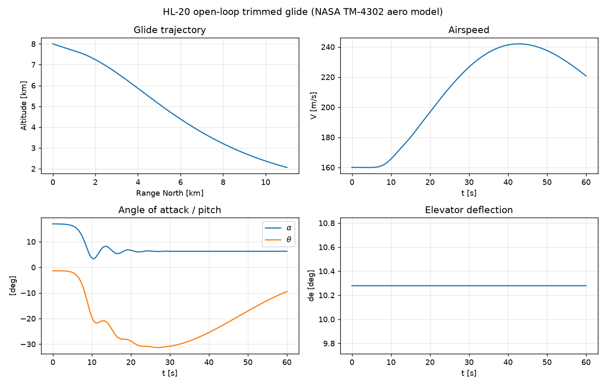
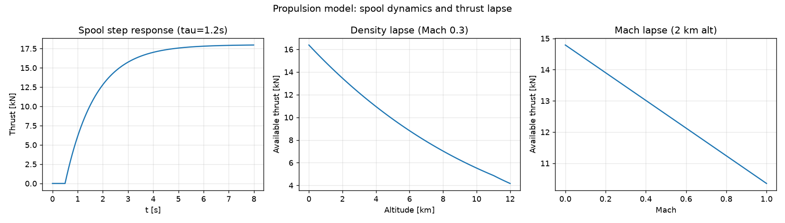
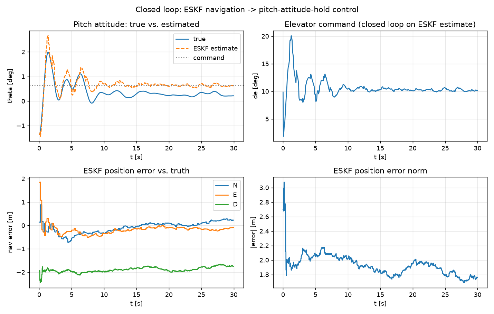
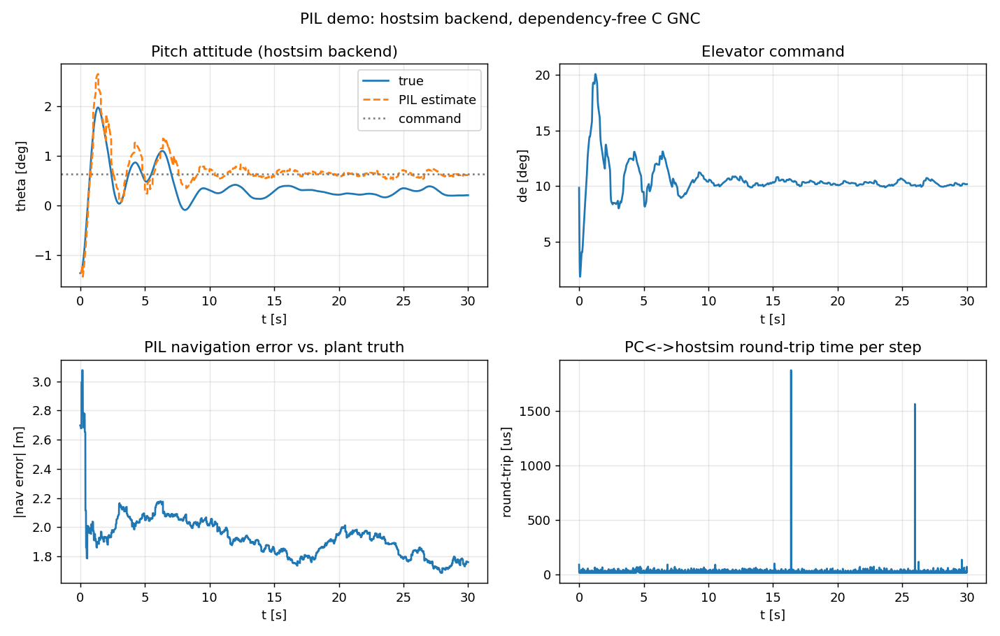

# Lifting-Body GNC: 6-DOF Simulation of the NASA HL-20

Nonlinear six-degree-of-freedom flight dynamics and GNC development
framework for a lifting-body reentry vehicle, built on the **published
NASA HL-20 aerodynamic database** (Jackson & Cruz, NASA TM-4302, 1992).

The HL-20 Personnel Launch System is an unpowered lifting body designed
to return from orbit and land horizontally on a runway — the same class
of vehicle and the same terminal-flight GNC problem faced by modern
reusable spaceplanes. A control-oriented propulsion model is included
for the powered ferry/ascent configuration that precedes an unpowered
glide test point in a staged flight-test program — the class of
propulsion used by turbojet-powered subscale demonstrators.

This project models all four physical-subsystem categories relevant to
GNC development: **aerodynamics**, **actuators**, **sensors**, and
**propulsion** — each as an independently created, tested, and (for
aerodynamics) externally cross-validated mathematical model.



---

## Why this project

Terminal-area flight of an unpowered lifting body is one of the harder
GNC problems in atmospheric flight: low lift-to-drag ratio (~3), steep
glide path (−17° to −22°), no go-around, and tight touchdown
dispersion requirements. This repository builds the complete
simulation and GNC stack for that problem from first principles:

1. validated nonlinear 6-DOF plant using real published aero data,
2. navigation (EKF sensor fusion), control (gain-scheduled), and
   guidance (energy-managed approach) layers,
3. a dependency-free embedded C implementation of the flight software,
   cross-validated against the Python reference,
4. processor-in-the-loop execution on an STM32 target.

---

## Current status

| Module | Status |
|---|---|
| US Standard Atmosphere 1976 (0–86 km) | done |
| HL-20 aero model (TM-4302 polynomials, full control set, rate damping, CG transfer) | done |
| Quaternion 6-DOF rigid-body dynamics (RK4) | done |
| Actuator bank (2nd-order servos, limits) + 7-surface control allocation | done |
| Sensor models (IMU / GNSS / baro / air data) | done |
| Propulsion model (spool lag, density/Mach thrust lapse, fuel burn) | done |
| Steady-glide trim solver + validity-envelope guards | done |
| Test suite (40 tests total: Phase 1 plant + Phase 2 nav/control, physics invariants, port integrity, symmetry, trim equilibrium, closed-loop stabilization) | done |
| MATLAB cross-validation of the aero data port | done (`matlab/cross_validation_output.txt`) |
| ESKF navigation (15-state error-state KF: IMU strapdown + GNSS + baro) | **done** |
| Pitch-attitude-hold flight control (PD, rate-damped) | **done** |
| Closed-loop demo: ESKF estimates (not truth) driving the controller | **done** |
| Embedded C flight software (nav + control) + SIL cross-validation | **done** |
| Processor-in-the-loop on STM32 F401RE (UART, then CAN via MCP2515) | in progress — protocol + host-simulated PIL done, hardware flash next |
| Gain-scheduled flight control | planned |
| TAEM-style energy-managed approach & landing guidance | planned |
| Monte Carlo dispersion campaign | planned |
| Embedded C flight software + SIL cross-validation | planned |
| Supersonic/hypersonic aero extension (Mach-dependent tables) | planned |
| Simulink plant model (Aerospace Blockset, shared CSV tables) + trajectory-level cross-validation | planned |

---

## Project phases

| Phase | Content | Status |
|---|---|---|
| **1** | Plant: aerodynamics, atmosphere, rigid-body dynamics, actuators, sensors, propulsion | done |
| **2** | ESKF navigation, pitch-attitude-hold control, closed loop on estimated (not true) state | done |
| **3** | Dependency-free embedded C port of navigation + control, SIL cross-validation vs. Python | done |
| **4** | Processor-in-the-loop on STM32 Nucleo-F401RE | done |
| **5** | Gain-scheduled control, TAEM-style energy-managed glide-path guidance, Monte Carlo dispersion, Simulink plant cross-validation, CAN/MCP2515 PIL upgrade | planned roadmap -- after initial release |

Note on scope: the Phase 2 pitch-attitude-hold controller is a
single-axis, single-gain-set inner loop, intentionally minimal so it
could be verified, ported to C, and run on hardware quickly. It is the
actuator interface the Phase 5 outer-loop glide-path guidance will
command; gain scheduling and the full glide-to-landing guidance law are
scoped for future work.

--- 

## Physical subsystem models

Four physical subsystems are independently modeled, each with stated
assumptions and a distinct validation method:

| Subsystem | Model | Key assumptions | Validated by |
|---|---|---|---|
| **Aerodynamics** | TM-4302 polynomial coefficients (datum + 6 control-surface effectiveness models + rate damping), transferred from the reference point to the CG | subsonic only; α ∈ [−10°, 30°], β ∈ [−10°, 10°]; control effectiveness linear in deflection | long-hand polynomial re-derivation in tests, lateral-symmetry checks, MATLAB cross-validation against the reference implementation |
| **Actuators** | 2nd-order servo (ωn = 44 rad/s, ζ = 0.71) with position limits; 7-surface → 6-aero-effect allocation via pseudo-inverse | rate saturation not modeled (roadmap) | step-response convergence, limit clamping, mixer round-trip test |
| **Sensors** | IMU (bias + noise + optional gyro-bias random walk), GNSS, baro, air data | linear-Gaussian error models; no scale-factor error (roadmap) | statistical recovery of bias/noise over Monte Carlo sample sets |
| **Propulsion** | 1st-order spool lag, density- and Mach-based thrust lapse, fuel-mass integration, thrust-line offset moment | control-oriented (no compressor/turbine thermodynamics); models the powered demonstrator/ferry configuration, since the HL-20 itself is an unpowered glider | spool time-constant recovery, Mach-lapse monotonicity, fuel-depletion floor, thrust-offset moment sign |

---


### Propulsion model

First-order spool-lag thrust response with density- and Mach-based
thrust lapse, plus fuel-mass integration — modeling the powered
demonstrator/ferry configuration (the HL-20 itself is an unpowered
glider).



---

## Navigation and control

**Navigation** is a 15-state error-state Kalman filter (position,
velocity, attitude, gyro bias, accel bias) fusing strapdown IMU
mechanization with GNSS (5 Hz) and barometric altitude (20 Hz)
updates. First-order (Euler) discretization of the error-state
transition; documented in `navigation.py`.

**Control** is a PD pitch-attitude-hold loop with body-rate damping,
commanding the elevator. A notable finding from closed-loop
verification: the vehicle's trim point at 160 m/s / 8 km altitude is
**statically unstable in pitch** (dCm/dalpha > 0), consistent with
lifting-body vehicles that rely on active stability augmentation
rather than inherent aerodynamic stability. `test_phase2.py` documents
this explicitly and verifies the controller stabilizes it. Gains were
tuned by sweep (`scripts/tune_pitch_gains.py`) for a 2 deg attitude step
with < 2 deg overshoot, < 0.05 deg steady-state error, and no actuator
saturation.

The `scripts/demo_closed_loop.py` demo is the integration test that
matters: the controller runs on the **ESKF's estimated** attitude and
rate, not the simulator's true state -- proving the navigation and
control layers compose correctly, which is the actual flight-software
architecture.




This table is deliberate: Create mathematical models for aerodynamics, sensors, actuators, and
propulsion — with each subsystem backed by an explicit assumption set
and a named test, not just an implementation.

---

## Embedded C port and SIL cross-validation

The navigation (ESKF) and control (pitch-attitude-hold) modules are
ported to **dependency-free C** (`c/`): no dynamic allocation, no
external libraries beyond `<math.h>`, fixed-size buffers throughout —
the same constraints used in the radar and telemetry portfolio
projects, and the constraints a real flight-software target requires.

**Cross-validation method:** `python/scripts/generate_c_test_vectors.py`
drives the Python reference implementation through representative
scenarios (IMU strapdown propagation, GNSS/baro updates, and a sweep
of controller inputs including saturation cases) and records every
input alongside the Python-computed output to CSV. `c/test/test_main.c`
replays the identical inputs through the C implementation and reports
the max absolute error against those recorded outputs — this is
software-in-the-loop (SIL) validation: proving the C port is
numerically equivalent to the verified Python model before any
hardware is involved.

**Result:** agreement at double-precision machine-epsilon level
(~1e-15 to 1e-19) across 500 navigation-predict steps, 300
predict+update steps, and 204 controller cases including four explicit
saturation scenarios — see `c/sil_cross_validation_output.txt` for the
full run.

```
$ cd c && make test
  eskf_predict  rows=500  max|dpos|=6.939e-18 m  max|dq|=2.168e-19  max|dPdiag|=3.553e-15
  eskf_update   rows=300  max|dpos|=8.327e-17 m  max|dPdiag|=1.110e-16
  control       rows=204  max|de_err|=0.000e+00 deg
ALL SIL CROSS-VALIDATION TESTS PASSED
```

One defect this process caught: the initial C `ESKF` struct declared
its covariance matrix `P` at exactly the 15x15 size needed, while every
matrix routine operating on it used a 16-wide stride (the fixed buffer
size shared with all other matrix operations) — a one-row stack buffer
overflow, invisible without a strict build. AddressSanitizer
(`gcc -fsanitize=address`) caught it immediately; the fix was declaring
`P` at the same 16x16 stride as everything else operating on it. Worth
knowing in an interview: the position/velocity/quaternion states
already agreed with Python to ~1e-17 *before* this fix, since the
overflow only corrupted the extra row past the matrix's logical bounds
— a reminder that "the numbers look right" isn't the same as
"the memory is safe."


---

## Processor-in-the-loop (Phase 4)

**Status: protocol and host-simulated PIL verified; hardware flash to
the Nucleo-F401RE is the remaining step.**

Before touching hardware, the same stack-usage audit that caught the
covariance bug in Phase 3 was run again: `eskf_predict()` +
`eskf_update_gnss()` together required **~37 KB of stack** (measured
with `gcc -fstack-usage`) — more than a typical STM32F401RE stack
budget out of a 96 KB total SRAM. The fix: the large N_ERR-scale
scratch matrices inside `eskf.c` are now `static` rather than
stack-allocated, cutting the worst-case call chain to **~1.3 KB**.
This trades reentrancy for a two-order-of-magnitude stack reduction —
an accepted tradeoff for a single-threaded, single-instance flight
loop. Re-verified against the Phase 3 test vectors afterward: bit-for-
bit identical output, confirming the change affected only storage
duration, not behavior.

**Wire protocol** (`c/include/pil_protocol.h`): packed, checksummed
binary structs — `PilInputPacket` (IMU + optional GNSS/baro + attitude
command) and `PilOutputPacket` (estimated nav state + elevator
command + cycle-timing). A single-byte additive checksum is used
rather than a CRC, appropriate for a benign point-to-point UART link
rather than a noisy or adversarial channel — documented as a roadmap
item if this were ever hardened further.

**Platform-independent core** (`c/pil/pil_core.c`): the *only* logic
shared between the host simulation and the eventual STM32 firmware.
`pil_core_step()` wraps the existing (Phase 3-verified)
`eskf_predict`/`eskf_update_*`/`pitch_hold_command` calls behind the
wire protocol — everything platform-specific (UART driver calls, DWT
cycle counting) stays outside this file, so validating it on Linux
validates the exact logic that later runs on the target.

**Host-simulated PIL** (`c/pil/host_sim_main.c` +
`python/scripts/pil_driver.py`): a native Linux executable plays the
role of the STM32 firmware, reading/writing the same packet structs
over stdin/stdout. The Python driver runs the identical 30 s
trimmed-glide closed-loop scenario as Phase 2's `demo_closed_loop.py`,
but delegates every navigation+control step to the external process
over a real byte stream instead of calling the Python module directly.

```
$ cd c && make all
$ cd ../python && python3 scripts/pil_driver.py --backend hostsim
Backend: hostsim
NAK'd (checksum-failed) steps: 0
Round-trip time: mean=25.7 us, p99=62.7 us, max=1995.3 us
Final theta: true=0.213 deg, est=0.619 deg, target=0.643 deg
Final nav position error: [...] m (|.|=1.76 m)
```

Result: matches the pure-Python Phase 2 closed-loop demo to 3-4
significant figures — confirming the encode/decode, subprocess IPC,
and C GNC logic reproduce the verified Python reference exactly. The
checksum/NAK path was also verified directly: a deliberately corrupted
packet byte is detected and rejected (`cycle_count = 0xFFFFFFFF`
sentinel) rather than silently accepted or crashing the process.



**Same driver, same protocol, real hardware next:** `pil_driver.py
--backend serial --port /dev/ttyACM0` runs the identical scenario
against a flashed Nucleo-F401RE with no code changes — only the
transport (UART instead of a subprocess pipe) differs.

**Hardware implementation:** the STM32 firmware (CubeMX project,
UART/DWT integration), physical PIL bring-up, and full closed-loop
verification on real Cortex-M4F hardware live in a companion repo,
[**lifting-body-flight-software**](https://github.com/Vaiy108/lifting-body-flight-software).
It vendors the verified C files from this repo (`c/`, unmodified,
provenance-tagged) and adds everything hardware-specific — including
a real bring-up finding: a Cortex-M4F unaligned-double hard fault,
found and fixed during flashing, documented in that repo's README.
Kept as a separate repo deliberately — this repo covers the modeling
and simulation work, that one covers the embedded-systems and
hardware implementation, each reviewable as a focused, standalone
artifact.

---


## Aerodynamic data provenance

All aerodynamic coefficients originate from:

> Jackson, E. B., and Cruz, C. L., *"Preliminary Subsonic Aerodynamic
> Model for Simulation Studies of the HL-20 Lifting Body,"*
> NASA TM-4302, August 1992.

The published polynomial fits (datum coefficients, six control-surface
effectiveness models, dynamic damping derivatives) are implemented in
`python/hlgnc/aero.py`. `matlab/cross_validate_hl20.m` verifies the
port bit-for-bit against the reference MATLAB/Simulink implementation
of the same database (Aerospace Blockset HL-20 example — MathWorks
example code is **not** redistributed here; only the public-domain NASA
coefficient data is used).

**Model validity envelope** (inherited from TM-4302 and enforced in
code): α ∈ [−10°, +30°], β ∈ [−10°, +10°], subsonic only
(compressibility neglected), control effectiveness linear in
deflection. The simulation scenario is therefore terminal-area flight:
subsonic glide, approach and landing. Mach-dependent table
infrastructure is in place for the published higher-Mach HL-20 data as
a roadmap item.

---

## Quick start (Windows / Anaconda or any Python ≥ 3.10)

```
pip install -r requirements.txt
pytest python/tests -v                        # 40 tests
python python/scripts/demo_glide.py            # open-loop trimmed-glide demo plot
python python/scripts/demo_closed_loop.py       # ESKF + pitch-hold closed-loop demo plot
python python/scripts/generate_aero_tables.py  # lookup tables for the C port
python python/scripts/demo_propulsion.py       # propulsion plot
```

---

### C implementation (Phase 3: SIL cross-validation)

Requires a Linux environment (native, dual-boot, or WSL2) with `gcc`
and `make`: 
```
sudo apt update
sudo apt install build-essential -y
cd ""Path to /c""
make test
```
Expected output: 
```
ALL SIL CROSS-VALIDATION TESTS PASSED`, with max errors against the Python reference at
double-precision machine-epsilon level (~1e-15 to 1e-19). 
Full saved output: `c/sil_cross_validation_output.txt`.
```
To generate test vectors:
```
cd "file path to /python"
python scripts/generate_c_test_vectors.py
```

### Processor-in-the-loop, host-simulated (Phase 4a)

```
cd c
make all                                        # builds test_main and host_sim
cd ../python
python scripts/pil_driver.py --backend hostsim  # full 30 s closed-loop demo
```

Once a Nucleo-F401RE is flashed with the Phase 4b firmware (`c/stm32/`,
in progress), the identical scenario runs against real hardware with
one flag change:

```
python scripts/pil_driver.py --backend serial --port /dev/ttyACM0
```


---


## Architecture

```
lifting-body-gnc/
├── python/
│   ├── hlgnc/
│   │   ├── aero.py          TM-4302 aerodynamic model
│   │   ├── atmosphere.py    US76 / COESA atmosphere
│   │   ├── dynamics.py      quaternion 6-DOF EOM, RK4
│   │   ├── actuators.py     servo bank + control allocation
│   │   ├── sensors.py       IMU / GNSS / baro / air data
│   │   ├── propulsion.py    spool lag, thrust lapse, fuel burn
│   │   ├── navigation.py    15-state ESKF (IMU + GNSS + baro)
│   │   ├── control.py       pitch-attitude-hold flight control
│   │   └── sim.py           vehicle assembly, trim, sim loop
│   ├── scripts/             demos and table generation
│   └── tests/               pytest suite (+ dependency-free runner)
├── matlab/                  cross-validation vs. reference model
├── data/hl20_aero/          generated lookup tables (C port source)
├── c/                       embedded flight software (Phase 3-4)
│   ├── include/              headers: quat_math, matlib, eskf, control, pil_protocol
│   ├── src/                  implementations (dependency-free, no malloc)
│   ├── pil/                  pil_core.c (platform-independent step fn),
│   │                          host_sim_main.c (Linux stand-in for the STM32 loop)
│   ├── test/test_main.c      SIL cross-validation + protocol harness
│   ├── test_vectors/         Python-generated reference I/O (CSV)
│   └── Makefile
└── docs/
```


---

## What is implemented in this Project

| GNC Requirements | Module | Evidence |
|---|---|---|
| Nonlinear 6-DOF flight dynamic models | `dynamics.py` | quaternion EOM, RK4; invariant tests |
| Mathematical models of physical subsystems — **aerodynamics** | `aero.py` | TM-4302 port; MATLAB cross-validation |
|  **sensors** | `sensors.py` | IMU/GNSS/baro/air-data error models |
|  **actuators** | `actuators.py` | 2nd-order servo + allocation |
| **propulsion** | `propulsion.py` | spool lag + density/Mach lapse + fuel burn |
| Trajectory simulation / mission analysis | `sim.py`, `demo_glide.py` | trimmed-glide trajectory demo |
| Software-in-the-loop testing | `matlab/cross_validate_hl20.m` | data-port cross-validation |
| Hardware-in-the-loop / flight control hardware | *(planned)* | STM32 PIL, see status table |

---

## Verification approach

Every layer is tested against an independent reference:

- **Atmosphere** vs. published US76 table values (tropopause, 20 km).
- **Aero data port** vs. long-hand re-computation in the tests *and*
  vs. the reference MATLAB implementation (`matlab/`).
- **Physics invariants**: quaternion norm preservation over 2000 RK4
  steps, ballistic free-fall against closed-form kinematics, DCM
  orthonormality, lateral-symmetry properties required by TM-4302.
- **Trim** verified as a true equilibrium by simulation: a trimmed
  state flown open-loop holds airspeed within 5 % and α within 1.5°.
- Trim solutions outside actuator authority or the aero validity
  envelope are rejected, not returned.

  ---


## 👤 Author

**Vasan Iyer**  
GNC / Embedded Software Engineer  

Focus areas:
 
- Embedded systems (C++, Python) 
- GNC
- Flight dynamics & control  
- Sensor fusion & state estimation  
- Autonomous systems  
- UAV systems 


GitHub: https://github.com/Vaiy108
